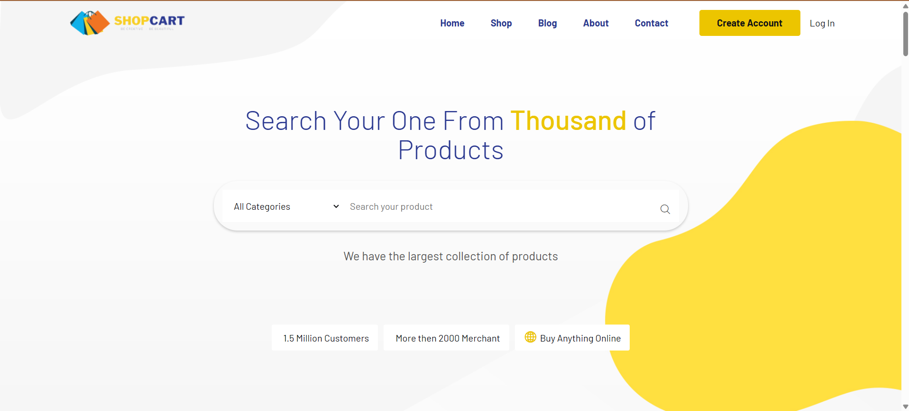
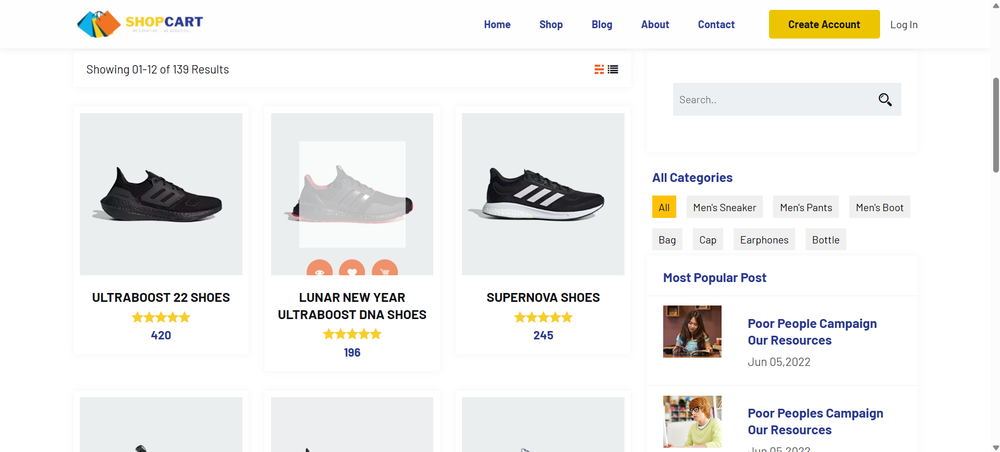
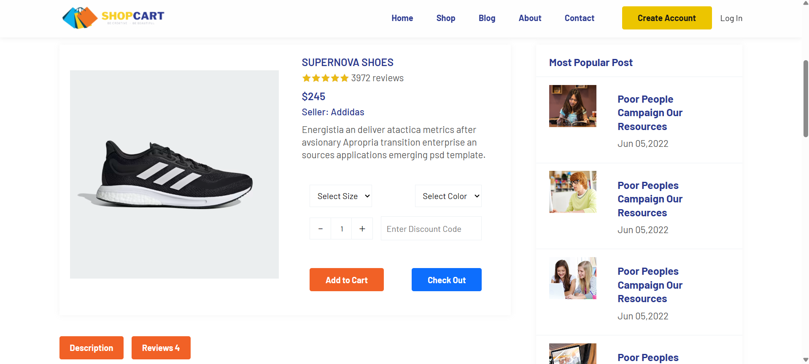
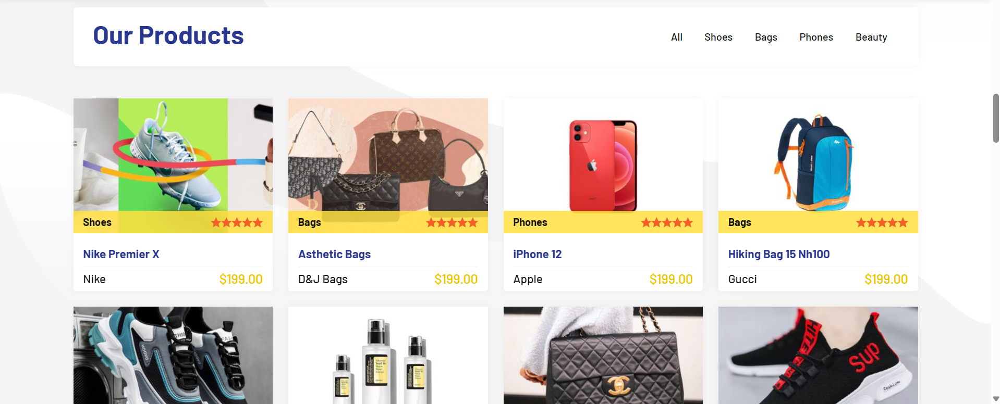
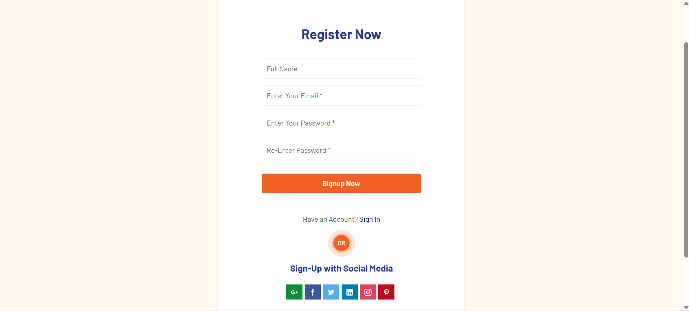

# Project Title

A brief description of what this project does and who it's for

# 🛒 ShopCart E-commerce

A modern e-commerce web application built with **React + Vite**, designed to provide a seamless shopping experience with product browsing, cart management, and secure checkout.

---

## 📖 Table of Contents
- [Overview](#overview)
- [Features](#features)
- [Tech Stack](#tech-stack)
- [Installation](#installation)
- [Usage](#usage)
- [Project Structure](#project-structure)
- [Screenshots](#screenshots)
- [Contributing](#contributing)
- [License](#license)

---

## 📌 Overview
ShopCart E-commerce is a full-featured online shopping platform. It allows users to explore products, add them to a cart, and proceed through a streamlined checkout process. The project demonstrates modern front-end development practices and can be extended with backend APIs for real-world use.

---

## ✨ Features
- 🔍 **Product Catalog** – Browse and search products easily  
- 🛒 **Shopping Cart** – Add, update, and remove items  
- 👤 **User Authentication** – Sign up, log in, and manage accounts  
- 💳 **Checkout Flow** – Simple and secure checkout process  
- 📱 **Responsive Design** – Optimized for mobile and desktop  
- ⚡ **Fast Performance** – Powered by Vite for blazing-fast builds  

---

## 🛠 Tech Stack
- **Frontend:** React, Vite, JavaScript, React Router  
- **Styling:** CSS, Bootstrap, SCSS
- **Authentication**: Firebase
- **DataBase:** MySQL 
- **State Management:** React Hooks, Context API
- **Fonts:** Google Fonts API, Font Awesome
- **Graphics:** Google Charts
- **Maps:** Google Maps 
- **Version Control:** Git & GitHub  

---

## 🚀 Installation

Clone the repository and install dependencies:

```bash
git clone https://github.com/Yashtagad12/shopcart-ecommerce.git
cd shopcart-ecommerce
npm install
npm run dev
npm run build
```
---

## 📂 Project Structure

```SHOPCART-ECOMMERCE/
├── .firebase/             # Firebase configuration and deployment files
├── dist/                  # Production build output
├── node_modules/          # Installed dependencies
├── ShopCart/
│   └── src/
│       ├── about/         # About page components
│       ├── assets/        # Static assets (images, icons, etc.)
│       ├── Blog/          # Blog-related components/pages
│       ├── Components/    # Reusable UI components
│       ├── contactpage/   # Contact page components
│       ├── contexts/      # Context API for global state
│       ├── firebase/      # Firebase integration logic
│       ├── Home/          # Homepage components
│       ├── PrivateRoute/  # Route protection logic
│       ├── Shop/          # Shop/product listing components
│       ├── utils/         # Utility/helper functions
│       ├── App.css        # Global styles
│       ├── App.jsx        # Root React component
│       ├── index.css      # Base CSS
│       ├── main.jsx       # Entry point
│       └── products.json  # Product data
├── .env.local             # Local environment variables
├── .gitignore             # Git ignore rules
├── eslint.config.js       # ESLint configuration
├── index.html             # Main HTML template
├── package-lock.json      # Dependency lock file
└── README.md              # Project documentation
```
---

## 🖼 Screenshots

<p align="center">
  
</p>

<p align="center">
  
</p>


<p align="center">
  
</p>

<p align="center">
  
</p>

<p align="center">
  
</p>


## 🤝 Contributing
Contributions are welcome!

Fork the repository

Create a new branch (git checkout -b feature-name)

Commit your changes (git commit -m "Add new feature")

Push to your branch (git push origin feature-name)

Open a Pull Request

## 📜 License
This project is licensed under the MIT License – feel free to use and modify it.

## 📧 Contact
Created by Yash Tagad – feel free to reach out for collaboration or feedback!
